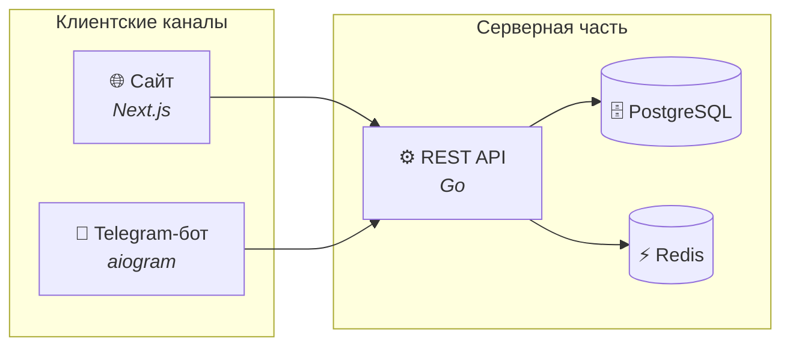
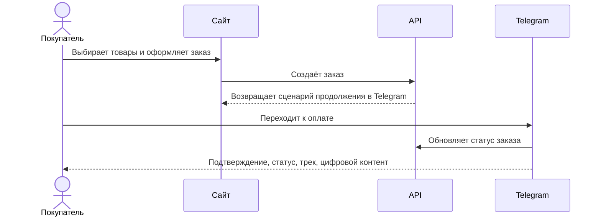

<div align="center">

# 🍫 АртШоколад

### Hybrid e-commerce для шоколадных форм  
### Telegram — для оплаты, сопровождения заказа и управления бизнесом

<br/>

[](https://artchocolateform.ru)
[](https://t.me/artchocolate_bot)

<br/>

[](https://nextjs.org/)
[](https://www.typescriptlang.org/)
[](https://go.dev/)
[](https://docs.aiogram.dev/)
[](https://www.postgresql.org/)
[](https://redis.io/)
[](https://www.docker.com/)

<br/>

[Идея](#-идея) · [Что особенного](#-что-делает-проект-особенным) · [Возможности](#-возможности) · [Архитектура](#-архитектура) · [Стек](#-стек) · [Дизайн](#-дизайн)

</div>

---

## ✨ Идея

**АртШоколад** — это гибридный e-commerce-проект для продажи **авторских ПЭТ-форм для шоколада**.

Покупатель проходит путь в двух привычных каналах:

- **на сайте** — выбирает товары, изучает каталог, оформляет заказ
- **в Telegram** — оплачивает, получает статусы, трек-номер и цифровой контент

Для владельца бизнеса это не просто интернет-магазин, а удобная операционная модель:

- каталог доступен клиентам на сайте
- сопровождение заказов происходит в Telegram
- управление заказами и товарами тоже собрано в Telegram
- **без отдельной админ-панели**

> Проект спроектирован вокруг мобильного трафика и реального пользовательского сценария:  
> **увидел → выбрал → оформил → продолжил в мессенджере**

---

## 💎 Что делает проект особенным

### 1. Гибридный customer journey
Сайт работает как визуальная витрина, а Telegram — как канал сопровождения заказа.

### 2. Управление без классической админки
Владелец бизнеса и команда работают через Telegram-интерфейс, без тяжёлой back-office панели.

### 3. Одна система для физического и цифрового товара
Проект поддерживает и доставку форм после оплаты.

### 4. Архитектура под реальный малый бизнес
Без избыточности: только те инструменты, которые действительно ускоряют продажи, обработку заказов и коммуникацию с клиентом.

---

## 🚀 Возможности

<table>
<tr>
<td width="50%" valign="top">

### Для покупателя

- 📱 Мобильная витрина с акцентом на быстрый выбор
- 🛒 Корзина с проверкой минимальной суммы заказа
- 🔎 Поиск по названию и артикулу
- 📦 Оформление доставки по России
- 💳 Оплата по реквизитам через Telegram-бота
- 📬 Получение статуса заказа и трек-номера
- 🎓 Автоматическая выдача цифрового контента после подтверждения оплаты

</td>
<td width="50%" valign="top">

### Для бизнеса

- 🏪 Управление каталогом через Telegram
- 📋 Обработка заказов и подтверждение оплат
- 🚚 Работа с доставкой и отправлениями
- 👥 Роли для команды
- 📄 Публичные юридические документы на сайте
- 🔒 Безопасная серверная архитектура с изоляцией сервисов

</td>
</tr>
</table>

---

## 🧭 Как выглядит путь заказа

```text
Сайт → корзина → оформление → переход в Telegram → оплата → подтверждение → статус / доставка / цифровой контент
```

---

## 🏗 Архитектура

Проект построен как единая система из трёх пользовательских точек:

- **сайт** — каталог и оформление
- **Telegram-бот** — коммуникация, оплата, статусы
- **backend API** — единая бизнес-логика и данные



### Сценарий оформления заказа



---

## 🛠 Стек

| Слой | Технологии |
|------|------------|
| **Frontend** | Next.js, React, TypeScript, Tailwind CSS |
| **Backend API** | Go, REST, GORM |
| **Telegram Bot** | Python, aiogram 3 |
| **Data Layer** | PostgreSQL, Redis |
| **Infra** | Docker, reverse proxy, TLS |

---

## 🎨 Дизайн

Визуальная концепция — **люксовый минимализм** с акцентом на нишу ручного шоколада.

| Направление | Решение |
|-------------|---------|
| **Палитра** | Светлая база, мягкие пастельные тона, акцент `#C44B6E` |
| **Типографика** | DM Serif Display для заголовков и цен |
| **UX-фокус** | Крупные фото товаров, заметная корзина, быстрый mobile checkout |
| **Поведение** | Минимум шагов от просмотра до заказа |

Сайт адаптирован под трафик из соцсетей и мессенджеров, где решение о покупке часто принимается быстро и с телефона.

---

## ℹ️ О репозитории

Этот репозиторий — **публичная презентация проекта**.

Он показывает:

- продуктовую идею
- архитектурный подход
- используемый стек
- формат реализации для продакшена

Исходный код, конфигурация инфраструктуры и внутренняя документация в открытом доступе **не публикуются**.

---

<div align="center">

### Разработка

[](https://chelaran.ru)

*Веб · Telegram-боты · интеграции · продакшен*

<br/>

**Сделано с 🍫 для мастеров шоколада**

</div>
